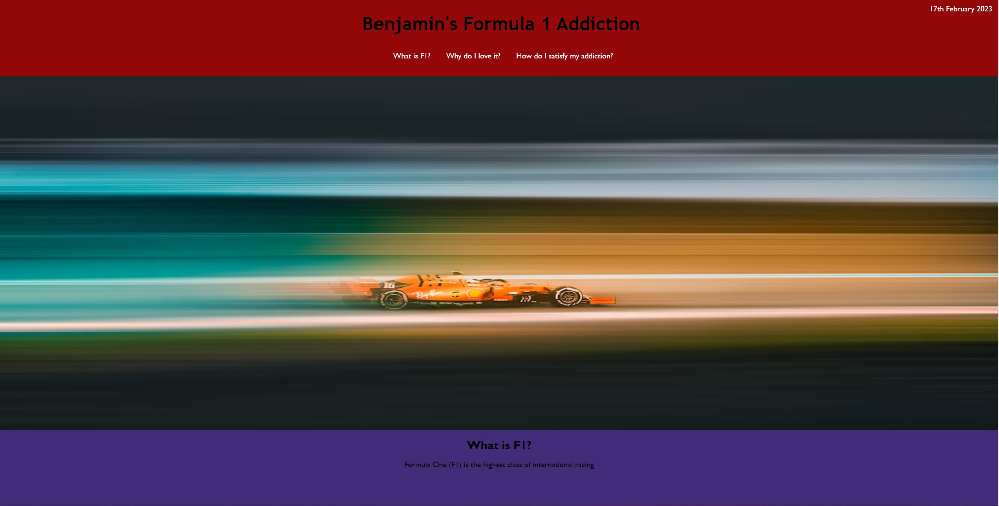

# Hobby-Page - Founders & Coders
As part of my application to join the Founders & Coders apprenticeship, I have created a hobby page.

## The Goal

The goal was to create a Hobby Page, discussing a particular interest. The idea was to showcase HTML, CSS and simple JavaScript. 

## Requirements

The requirements for the page were:

    - The page has an informative title,
    - The page has a logical layout and clear structure,
    - There are images ont he page, with alt-text if required,
    - The page is visually interesting, showcasing CSS abilities,
    - A list is visible on the page,
    - The page is responsive,
    - The page includes a header and a footer element,
    - The page shows the current date, and it should always be correct. 

## How did I make the site?

### Planning

When planning this challenge, I broke down requirements above, decided how I was going to approach each individual item and went back through old projects to find code which could be helpful - such as examples of moment being successfully used to create the current date. 

### Building & Debugging

I started with a basic HTML layout. A header, a footer, and a title. From there I added the navigation menu as I knew that is how I wanted to implement a list. Once the navigation menu was in, I decided upon the layout and started adding the CSS. 

I firstly wanted pictures to the side of each text section, however I was not happy with its responsiveness on different devices. I searched for pictures which would look impressive at full width. I managed to find copyright free images of four different teams' cars. I arranged them to point in alternating directions. The team colours of each car were used as the background above the images. In the sample application image, you will notice the red above the Ferrari, and the blue/purple above the Red Bull. 

I added links to the list items in the nav bar to improve user experience and added a home link in the footer. I added a link to the Formula One website to meet the challenge criteria and added a link to my GitHub profile in the footer.

I used media queries to help the sites responsiveness, and am happy with the current state, albeit improvements can be made. 

## Usage

To view the project, please follow the links below:

https://bcott93.github.io/Hobby-Page/

## License

Please see the License in the Repo.

## Credits

https://en.wikipedia.org/wiki/Formula_One - Used for the description of Formula One. 
